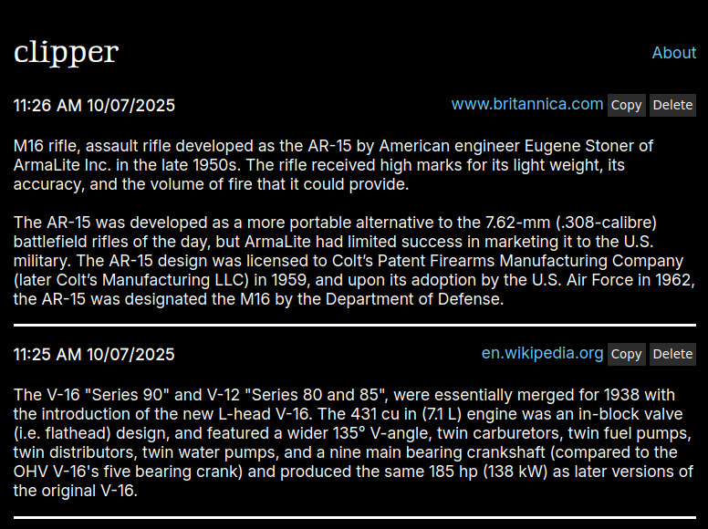

    

clipper helps you track and manage the last 100 things you have copied in your browser.

### Instructions to use

Since this is more of a practice thing (my first ever browser extension), I probably willnot publish this as an extension. However, you can run it by cloning the source, and sideloading the manifest.json from your browser settings.
